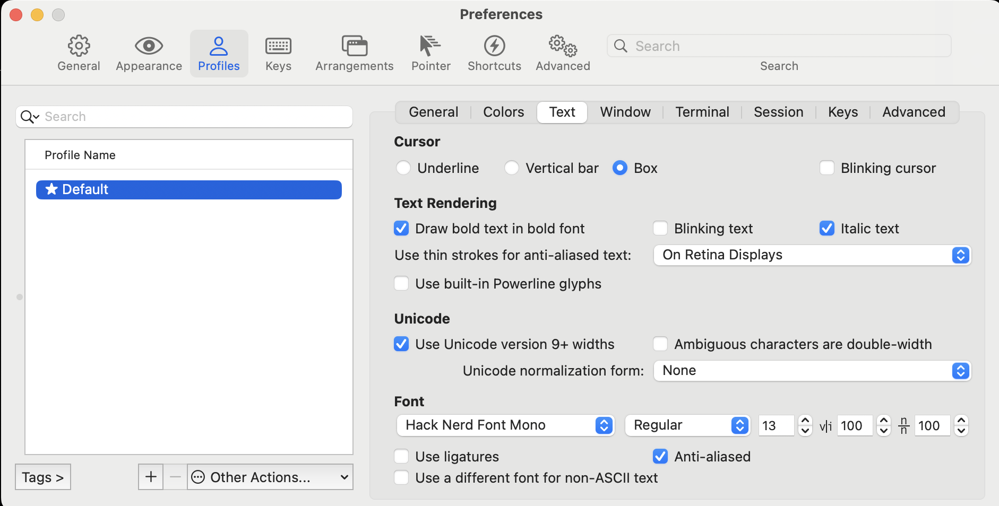

My configs for NeoVim.

# Plugins

## Lazy

- [Lazy](https://github.com/folke/lazy.nvim): the plugin manager

## neo-tree

- [neo-tree](https://github.com/nvim-neo-tree/neo-tree.nvim)

If icons are not shown, please install nerd-fonts, then enable the fonts in your terminal.

```bash
brew tap homebrew/cask-fonts
brew install font-hack-nerd-font
```

Then open `Preferences` in your terminal (iTerm2), select `Hack Nerd Font Mono` in your profile (under **Text** -> **Font**).


- [Icons are not showing in nvim-tree](https://vi.stackexchange.com/questions/40279/icons-are-not-showing-in-nvim-tree)
- [nerd-fonts](https://github.com/ryanoasis/nerd-fonts?tab=readme-ov-file#option-4-homebrew-fonts)
- [How to change Neovim font?](https://stackoverflow.com/questions/35285300/how-to-change-neovim-font)
